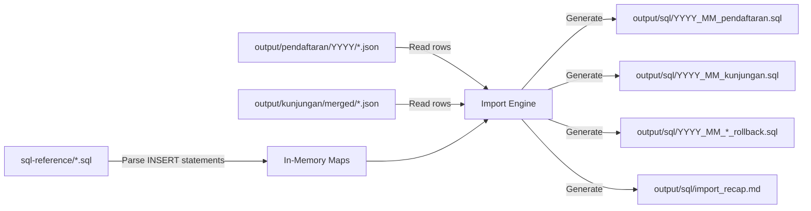

# Implementation Plan: IMPORT Mode — JSON-to-SQL Generation

Add an interactive IMPORT mode to the tool that reads exported JSON data from `output/` merged folders, maps fields to database table schemas using in-memory reference data from `sql-reference/`, and generates per-month SQL INSERT files with rollback DELETE scripts and a recap markdown report.

## Data Flow Overview



## Proposed Changes

---

### Interactive Menu

#### [MODIFY] [index.js](file:///d:/project/MyPharmaExportPuller/src/index.js)

- On `npm start`, prompt user with interactive question: **IMPORT** or **EXPORT**.
- Use Node.js built-in `readline` (no external dependency needed).
- If **EXPORT**: proceed with current export logic.
- If **IMPORT**: call new `runImport(log)` function from `src/importer.js`.

---

### SQL Reference Parser

#### [NEW] `src/sql-parser.js`

Parse phpMyAdmin SQL dump files from `sql-reference/` into in-memory `Map` objects for instant lookups:

| Reference Table | Lookup Key | Stored Value |
|---|---|---|
| `kk_kategori` | `nama` (LIKE, type=AGAMA) | `id` |
| `kk_kota` | `nama` (LIKE) | `id` |
| `kk_kecamatan` | `nama` (LIKE) | `id`, `id_kota` |
| `kk_desa` | `nama` (LIKE) | `id`, `id_kecamatan` |
| `kk_poli` | `nama` (LIKE) | `id` |
| `kk_users` | `nama_panggilan` / `nama_lengkap` (LIKE) | `id` |
| `kk_kategori_penyakit` | `kode` (exact match) | `id` |
| `kk_jenis_tindakan` | `nama` (closest match) | `id` |

---

### Import Orchestrator

#### [NEW] `src/importer.js`

Main entry point for import mode. Responsibilities:
1. Load all reference maps from `src/sql-parser.js`
2. Iterate through each month in `START_DATE` → `END_DATE` range
3. Process Pendaftaran and Kunjungan merged JSON files
4. Generate SQL + rollback files into `output/sql/`
5. Generate `output/sql/import_recap.md` report

---

### Pendaftaran Import

#### [NEW] `src/import-pendaftaran.js`

**Field Mapping** (per data row → `kk_pendaftaran`):

| JSON Field | DB Column | Transform |
|---|---|---|
| `__EMPTY` | `no_pendaftaran` | Direct (trim) |
| `__EMPTY_1` | `tanggal` | Reformat `DD-MM-YYYY` → `YYYY-MM-DD` |
| `__EMPTY_2` | `jam` | Direct |
| `__EMPTY_5` | `nama` | Direct (trim, uppercase) |
| `__EMPTY_6` | `agama` | Lookup `kk_kategori` (type=AGAMA) by nama LIKE → `id` |
| `__EMPTY_10` | `jenis_pasien` | Direct (`BARU`/`LAMA`) |
| `__EMPTY_12` | `desa` | Lookup `kk_desa` by nama LIKE → `id` |
| `__EMPTY_13` | `kecamatan` | Lookup `kk_kecamatan` by nama LIKE → `id` |
| `__EMPTY_14` | `kota` | Lookup `kk_kota` by nama LIKE → `id` |
| `__EMPTY_15` | `no_identitas` | Direct (trim) |
| `__EMPTY_16` | `telpon` | Direct (trim) |
| `__EMPTY_17` | `jenis_kelamin` | Map to `'1'` / `'2'` / `'3'` / `'4'` |
| `__EMPTY_18` | `place_of_birth` | If only `"JAKARTA"`, use kota name from `__EMPTY_14`; otherwise direct |
| `__EMPTY_19` | `tanggal_lahir` | Reformat `DD-MM-YYYY` → `YYYY-MM-DD` |
| `__EMPTY_21` | `alamat` | Direct (trim) |
| `__EMPTY_23` | `nomor_status` | Direct (trim) |

---

### Kunjungan Import

#### [NEW] `src/import-kunjungan.js`

**Field Mapping** (per data row → `kk_kunjungan`):

| JSON Field | DB Column | Transform |
|---|---|---|
| — | `id_pendaftaran` | Subquery: `(SELECT id FROM kk_pendaftaran WHERE no_identitas = '__EMPTY_13' OR nama = '__EMPTY_3' LIMIT 1)` |
| `__EMPTY_1` | `tanggal` | Reformat `DD-MM-YYYY` → `YYYY-MM-DD` |
| — | `waktu` | Fixed `'00:00:00'` |
| — | `id_antrian` | Fixed `0` |
| `__EMPTY_5` | `id_layanan` | Lookup `kk_poli` by nama LIKE → `id` |
| `__EMPTY_6` | `id_dokter` | Lookup `kk_users` by `nama_panggilan`/`nama_lengkap` LIKE → `id` |
| pendaftaran `__EMPTY_9` | `id_user` | Cross-reference matching pendaftaran row by NIK/nama, lookup `kk_users` for Perawat value → `id` |
| — | `id_perusahaan` | Fixed `0` |

**Child Tables**:
- `kk_pemeriksaan_diagnosa` from `__EMPTY_7` / `__EMPTY_8` (kode match)
- `kk_pemeriksaan_tindakan` from `__EMPTY_9` (tindakan name match)

---

### Recap Report

#### `output/sql/import_recap.md`

Markdown table listing unmatched/missing lookups with source file tracking:

```markdown
| Jenis | Dari File Mana | Nama | Field yang Kosong |
|---|---|---|---|
| pendaftaran | MyKlinik_2026_01.json | NIYAMA DHARMA | agama (BUDDHA not found), desa (KAPUK MUARA not found) |
| kunjungan | MyKlinik_2025_10_merged.json | AUDRY | id_dokter (dr. XYZ not found), diagnosa (A99 not found) |
```

---

## Verification Plan

### Automated Tests
- Syntax check with `node --check` across all new files.

### Manual Verification
- Test run `npm start` → select IMPORT → verify SQL files & `import_recap.md` generation.
